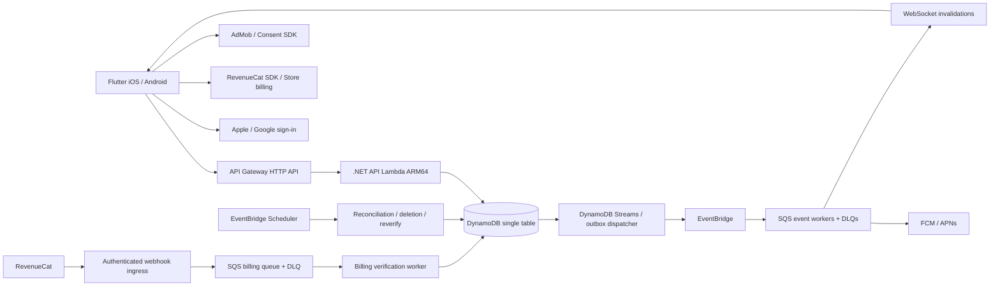

# Hisaab implementation plan

Status: original plan prepared 26 September 2026; implementation authorized and started the same day. See [current implementation status](docs/IMPLEMENTATION_STATUS.md) for delivered source, deviations and unverified release gates. The planning language and acceptance matrix below are preserved as the original baseline.

The repository currently contains only a README. This document turns the [supplied product specification](docs/hisaab-product-spec.md) into an implementation sequence. Producing this plan does not approve unresolved product decisions, create cloud resources, configure store products, or demonstrate that any acceptance criterion already passes.

## 1. Delivery scope and decisions

Build an India-first Flutter app for iOS and Android, backed by C# on AWS. The launch scope includes every MUST criterion in the specification: identity, groups and direct friends, all four split modes, accurate balances, settlement recording, activity, push preferences, ad placement policy, account-wide ad removal, purchase restoration, and account deletion. No expense-per-day paywall.

The specification's defaults remain planning assumptions until product/engineering approval:

| Decision | Planning assumption | Owner / deadline |
|---|---|---|
| Client | Flutter; feature folders; Riverpod for state; typed API client | Mobile lead, milestone M0 |
| Backend | .NET 10, Lambda ARM64, HTTP API, DynamoDB, EventBridge, SQS | Engineering lead, M0 |
| Infrastructure as code | AWS CDK in C#; separate dev/staging/prod stacks | Platform lead, M0 |
| Billing | RevenueCat; annual auto-renewing product; ₹299 India target; store-localized display price; no trial or Family Sharing | Product/mobile, M0 |
| Entitlement | One `ad_free` entitlement per Hisaab account across both stores | Product/backend, M0 |
| Currency and payments | Integer INR paise; settlement records only; no money movement | Product, M0 |
| Ads | AdMob; banners at launch; interstitial implementation tested but remotely disabled initially | Product, before monetization beta |
| Optional functionality | Multiple payers, category/notes, simplify debts and CSV export deferred; settings subscription status included | Product, M0 |
| Privacy | Optional contact data; personalized advertising only with valid consent; explicit retention schedule reviewed before launch | Product/privacy owner, M0–M1 |

Use a supported .NET 10 Lambda runtime rather than starting a new project on .NET 8 near its published deprecation date. Pin Flutter, .NET, CDK and package versions in M1 after compatibility tests. [AWS runtime support](https://docs.aws.amazon.com/lambda/latest/dg/lambda-runtimes.html)

### Decisions that affect architecture

These are recommendations, not silent changes to the supplied scope. Resolve them at M0 and record the result in decision records.

| Issue in the specification | Recommended resolution | Consequence if rejected |
|---|---|---|
| Apple-only iOS users cannot sign into the same account on Google-only Android | Include Apple's Android web flow in v1, bringing AC5 forward; otherwise require explicit Google linking before switching devices and document that limitation | Cross-platform entitlement promise cannot be unconditional |
| A 50-member cap does not by itself bound pairwise balance writes | Store one balance row per group ledger identity, including its bounded counterparty map; transact up to 50 such rows | Separate pair rows need a different transaction design |
| Former/deleted members can make a nominally 50-active-member group unbounded | For v1, cap retained ledger identities at 50, including placeholders and former/deleted members; a placeholder claim preserves its identity | An active-members-only cap requires a different balance/retirement model before implementation |
| Optional phone collection has no verification step, and OTP is excluded | Phone/email can address an invitation; only verified email or possession of a scoped invitation can authorize a claim. Never claim by an unverified typed phone number | Phone auto-matching needs an approved verification mechanism |
| “Within 2 seconds for everyone” is undefined for background/offline devices | Measure a p95 ≤2-second foreground, online convergence target; refresh strongly on open/resume/pull-to-refresh. Background push is best effort | A literal all-device guarantee is not feasible on mobile operating systems |
| A disputed recorded payment has no defined balance behavior | Apply a recorded payment immediately; receiver dispute reverses it exactly once and marks it disputed; both sides see the history | Product must choose a pending-confirmation model instead |
| Group deletion and archiving are conflated | Archive preserves history. Creator-only deletion is soft deletion; reject while balances are non-zero; retain shared records under the retention policy | Destructive deletion needs a separate accounting/privacy policy |
| Leaving with a non-zero balance only requires a warning | Require explicit acknowledgement; retain read access and the ledger identity until settled, mute optional notifications, and prohibit new expense assignment | Fully removing access would make unresolved debt hard to inspect/settle |
| “Only webhooks are unauthenticated” omits sign-in | Public auth initiation/exchange and public legal/deletion pages also exist; rate-limit them; never expose private group metadata | Sign-in cannot work without a public entry point |
| “No web app” conflicts with public deletion and legal URLs | Publish minimal static privacy, terms and account-deletion/help pages; no browser expense application | Store prerequisites remain incomplete |
| Existing separate Apple/Google accounts may already have ledgers/subscriptions | Link only after proving both identities; use a canonical account mapping without rewriting money history; explicitly test conflicting paid-account ownership | Do not release linking until recovery and billing ownership are defined |

Do not deploy, enable or provision SnapStart, OpenSearch/Elasticsearch/AOSS/SearchCache, or AWS WAF. This applies to code, IaC, scripts, defaults and deployment arguments. Existing resources, if later discovered, require separate review before any destructive cleanup.

## 2. Architecture and repository layout

Start with a modular backend, not a network service for every context. Keep domain types independent of AWS SDKs; use one C# type per file and feature folders. Separate deployable entry points where trust or retry behavior differs: authenticated API, billing ingress/worker, event worker and scheduled maintenance.



WebSocket invalidations are a proposed addition to the HTTP-only dependency list. They carry IDs and revisions, never the source of balance truth. Authenticate connections, authorize subscriptions against current membership, expire/revoke them with sessions, and send no expense descriptions in invalidation payloads. A short-lived one-use connection ticket avoids putting reusable access tokens in logged URLs.

| Context | Owns | Must not own |
|---|---|---|
| Identity | Provider subjects, canonical account, sessions, verified contacts, linking/deletion workflows | Ledger arithmetic or client-granted entitlements |
| Groups | Group types, roster, invitations, placeholder claims, archive/leave lifecycle | Copies of balances maintained outside ledger transactions |
| Ledger | Expenses, revisions, split calculation, balances, direct-friend ledger containers | Store products or delivery of notifications |
| Settlement | Recorded payments, dispute transitions, reversal commands | UPI transfers, wallets or payment initiation |
| Billing | Store ownership, verified entitlement snapshot, event history, support overrides | Identity merges based on store receipt or matching email |
| Notifications | Push tokens, per-type preferences, deduplicated delivery and activity projections | Authority to change expenses |
| Ads configuration | Allowed routes, frequency caps, consent requirements and kill switch | Names, email, phone or ledger content in ad requests |

Proposed layout; create this during M1, not as part of this planning change:

```text
apps/mobile/lib/{core,features,shared}/
apps/mobile/test/
apps/mobile/integration_test/
src/Hisaab.Domain/{Identity,Groups,Ledger,Settlement,Billing,Notifications,Ads}/
src/Hisaab.Application/<context>/<feature>/
src/Hisaab.Infrastructure/{DynamoDb,Identity,RevenueCat,Push}/
src/Hisaab.Api/<context>/<feature>/
src/Hisaab.Workers/<feature>/
tests/{Hisaab.Domain.Tests,Hisaab.Integration.Tests,Hisaab.Contract.Tests}/
infra/Hisaab.Cdk/
tools/support/
docs/{decisions,api,runbooks}/
```

## 3. Ledger rules to implement before UI integration

Use signed 64-bit integer paise for amounts, shares, paid contributions and balance deltas. Reject zero/negative expense totals and values above 1,000,000,000 paise (₹1,00,00,000). Parse decimal input explicitly with at most two fractional digits; do not multiply a binary floating-point input and round. Dates are calendar dates; audit timestamps are server UTC. Description: trimmed, non-empty, at most 100 agreed Unicode characters; define the same counting rule in client/server contracts.

All split calculations run in a shared set of versioned test vectors exercised by Dart and C#. Server recomputes before saving. Participant IDs are stable, unique and sorted ordinally; the preview displays this exact allocation order. Names and contact changes must not change the result.

| Mode | Calculation and validation |
|---|---|
| Equal | Divide paise by participant count; give one remaining paisa to each of the first N sorted participants |
| Exact | Accept non-negative integer paise; sum must equal total; name the unassigned or excess amount |
| Percentage | Require each basis-point allocation to be an integer in 0–10,000 and the sum to be exactly 10,000; floor proportional amounts, then assign remaining paise to the first N sorted participants with positive allocations; zero-percent entries stay zero |
| Shares | Proposed input bound: integer weights from 1–10,000 per participant; compute proportional floors and distribute remaining paise in the same order; use checked arithmetic |

Examples: ₹100 split equally across A/B/C is ₹33.34/₹33.33/₹33.33. With a ₹100 total and exact allocations summing to ₹87.50, show “₹12.50 left to assign”. A 90% allocation says “10% left to assign”; 110% says “10% over-assigned”. Add tests for the maximum amount, 50 participants, one-paisa totals, zero-percent remainder exclusion, negative/out-of-range percentages, duplicate participants, overflow and malformed decimals. Confirm the zero-percent exclusion as a rounding clarification at M0 and display the eligible order in the preview.

Define `netPaise > 0` as “is owed” and negative as “owes”. For one payer A, every other participant B contributes `share[B]` to A's counterparty balance and its negative to B's. Each row's net equals its counterparty sum; all group nets sum to zero; pair entries are antisymmetric. Do not infer direct debts solely from group net positions: cycles must remain visible while simplify-debts is off.

Record each expense's computed shares and ledger deltas. Edits apply the negative of the old deltas plus the new deltas in one transaction. Delete reverses once; restore within 30 days reapplies once. Version checks cover every transition. Keep immutable accounting revisions, with actor ID and structured field differences; resolve current display names at read time so deleted users become “Deleted user”. Avoid copying PII into activity payloads.

A settlement from debtor D to creditor C increases D's net and decreases C's net by the recorded amount. Validate both ledger identities and currency. Recommend allowing partial payments up to the outstanding direct pair debt; reject overpayment until a separate product decision supports credits. Cash/UPI/other is a label only. Either involved account may record the payment; for unclaimed placeholder, external or deleted identities, an authorized organizer may record on their behalf with the actual actor visible. Define that permission explicitly at M0. A receiver who later claims a placeholder inherits the right to dispute earlier payments to that identity; unrelated members never do. Decide the organizer correction process for a permanently deleted receiver at M0. The dispute command uses an expected version and records a compensating reversal atomically; retrying it cannot reverse twice. Notifications follow the committed event.

Expenses may be changed only by a currently authorized group member who participated in the original expense. Check original participation before allowing a changed participant set. Archived groups are read-only; explicitly reopening them restores write access. Direct-friend expenses use a hidden two-person ledger container and the same domain rules.

## 4. DynamoDB access-pattern proposal

Approve access patterns and transaction size proof before implementing repositories. Use one regional table per environment with `PK`, `SK` and only the required sparse indexes. Keep contact lookup values as keyed hashes and encrypted contact values where delivery needs them; ordinary hashes of phone numbers are enumerable. Resolve names from identity/member profiles instead of embedding them in every expense.

`uid` is a Hisaab account ID; `gid` includes direct-friend containers; `pid` is a stable group ledger identity, preserved through placeholder claim and deletion. An account can own ledger identities without their keys becoming mutable user IDs.

| Access pattern | Proposed key / index | Read/write notes |
|---|---|---|
| Account/session | `USER#uid / PROFILE`, `SESSION#sessionId / META` | Strong lookup; refresh tokens hashed; session revocation checked for mutations |
| Provider identity | `IDENTITY#issuer#subject / OWNER` | Unique conditional ownership; never key identity by email |
| Verified contact claim lookup | `CONTACT#hmac / ACCOUNT#uid` and invite references | Candidate lookup only; proof and explicit acceptance still required |
| Groups by user | `USER#uid / GROUP#gid` | Base-table membership edges written transactionally with joins/leaves; paginated |
| Group/roster | `GROUP#gid / META`, `GROUP#gid / MEMBER#pid` | Metadata stores bounded roster IDs, creator, archive flag, roster revision and ledger revision |
| Balances by group | `GROUP#gid / BALANCE#pid` | At most 50 rows; each has `netPaise`, signed counterparty map and version |
| Expenses by ID | `GROUP#gid / EXPENSE#expenseId` | Source state, expected version, date, tombstone and restore deadline |
| Expenses by date | `GROUP#gid / EXPENSEDATE#date#expenseId` | Transactional base-table pointer; Query 25 results with opaque cursor; move pointer on date edit |
| Change history/activity | `GROUP#gid / EVENT#revision#eventId` | Sort revision with fixed-width encoding; immutable minimal accounting event |
| Settlements | `GROUP#gid / PAYMENT#paymentId` | Same transaction and version discipline as expenses |
| Home totals and per-friend debts | User membership edges → own balance rows in each group | Strong reads; aggregate signed counterparty entries across groups, resolve claimed/deleted/external identities; no global user-pair write fan-out |
| Invite link | `INVITE#tokenHash / META` | Random bearer capability; scoped, expiring, revocable and use-limited; no raw contact in URL |
| Command replay | `COMMAND#uid#idempotencyKey / RESULT` | Request digest, stable operation/entity ID and committed response; written with mutation |
| Durable event delivery | `OUTBOX#eventId / META` | Written with domain change; dispatch via stream; sparse pending index for repair |
| Activity by user | `USER#uid / ACTIVITY#time#eventId` | Async fan-out, deduplicated; not balance truth |
| Current entitlement | `USER#uid / ENTITLEMENT#ad_free` | Strong account lookup; expiry/grace/provider ownership recorded |
| Billing history / event replay | `BILLINGEVENT#providerEventId / META`, `USER#uid / BILLING#time#eventId` | Immutable event identity; retain minimum provider metadata |
| Store transaction ownership | `STORE#store#transactionOrOriginalId / OWNER` | Supports support lookup and verified ownership checks |
| Push/preferences | `USER#uid / DEVICE#deviceId`, `USER#uid / PREFS` | Device tokens are sensitive; remove on logout/deletion/provider invalidation |
| Scheduled work | Sparse `WORK#type#shard / dueAt#id` GSI | Reverify, deletion and outbox recovery; workers recheck base-table state |

Add GSIs only for demonstrated non-critical discovery needs, including pending/due work and support lookup if base keys do not suffice. GSI/stream lag cannot determine a user's visible balance or authorization. DynamoDB GSIs do not offer strongly consistent reads. [AWS read consistency](https://docs.aws.amazon.com/amazondynamodb/latest/developerguide/HowItWorks.ReadConsistency.html)

### Transaction budget and concurrent changes

The proposed worst-case expense edit touches 50 balance rows, one expense row, one group metadata update, two date-pointer operations, one audit event, one outbox event, one command-result record, one actor-session condition and one active-account condition: at most **59 distinct actions**. Metadata conditions cover roster revision, archive state and the authorized actor's membership; balance updates carry their own version conditions. Every ownership/status change to a member increments the roster revision, so authorization from an earlier roster read cannot survive a concurrent claim or leave. The active-account condition enforces the deletion/linking write freeze even before all sessions are revoked. Do not add a separate condition action on an item already being updated.

This is a design budget, not a measured implementation result. A transaction-builder test must prove all commands stay below 100 actions and 4 MB, and every item below 400 KB, with maximum-length IDs, 50 participants and worst-case payer/participant/date changes. Do not put per-recipient notifications or home projections into this transaction. [AWS transaction limits](https://docs.aws.amazon.com/amazondynamodb/latest/APIReference/API_TransactWriteItems.html)

Two simultaneous adds may conflict on projection rows; retry transient transaction conflicts with bounded jitter and fresh projection versions. Keep the same command/entity ID. Both valid adds eventually succeed or return a retryable error; neither may disappear. A stale expense version returns HTTP 409 with “This expense changed — review latest” and the current authorized representation; never retry it as if it were an add. Separate business/version conflicts from throttling and capacity errors.

Use `TransactGetItems` for coherent group balance snapshots: metadata plus the known roster's balance rows. If roster discovery preceded the read, verify its revision inside the snapshot and retry on change. A strong Query/BatchGet alone is not a multi-item snapshot. Home aggregates independent strongly read per-group rows and must not claim a globally atomic point in time across all groups. Paginate/chunk memberships without silently omitting groups; measure fan-out cost before beta.

Persistent command records supplement DynamoDB's ten-minute `ClientRequestToken` window. Proposed replay retention: 30 days. A reused key with a different normalized request digest returns 409. Stable caller-generated expense/payment IDs and retained tombstones prevent creates from duplicating even after command-result expiry; stale edits remain version rejected. Expiration is checked in application logic, not inferred from physical TTL deletion. [AWS idempotency behavior](https://docs.aws.amazon.com/amazondynamodb/latest/developerguide/transaction-apis.html)

Keep the original ledger and its paired balance write atomic. Enforce any hard expense-count limit with a conditional group-metadata update in the same transaction; a separate preflight count is race-prone. The outbox dispatcher publishes only committed records, retries partial publish failures and marks completion after publish. Consumers use event IDs to tolerate duplicate delivery. A recovery worker republishes pending outbox records if stream processing is unavailable beyond its recovery window.

Nightly reconciliation recomputes nets and pair balances from accounting revisions at a stable group revision, using a revision-before/after check or an explicitly bounded snapshot. Alert on any difference; do not silently overwrite a live projection. Repair requires a version-guarded, audited operation. Paginate at 25 expenses for UI; maintenance jobs checkpoint and continue within Lambda time limits. Test groups at 10,000 expense IDs including deleted entries; whether this is a lifetime or active-only cap is an M0 contract decision.

## 5. Identity, invitations and privacy

Use provider `issuer + subject` as the credential identity and an opaque stable UUID as the Hisaab ID. Backend validates signature/JWKS, issuer, audience, expiry and nonce; do not accept a client-supplied email or user ID as authentication. Use secure OAuth state/PKCE where applicable and exchange/store the Apple authorization material needed for later revocation. Key rotation, replay, wrong-audience and expired-token tests are required.

Issue short-lived app access tokens with revocable, rotating refresh sessions. Keep refresh credentials in Keychain/Keystore, scope caches to the account, restore only that account on restart, and clear local caches/tokens/SDK customer state on sign-out. Retain no previous user's visible data during an account switch. Do not log provider tokens or refresh credentials.

Matching Apple/Google emails prompt an explicit linking flow. Reauthenticate both credentials, enforce unique credential ownership, then map to a canonical account; invalidate old sessions. Linking existing accounts must preserve all memberships, audit actors and subscriptions and cannot confer ownership merely through a matching address. A canonical account may inherit multiple participant IDs in the same group: membership lookup and home aggregation must include all of them, cancel self-directed pair balances in the personal summary, and preserve the original ledger. Scope this workflow and its failure recovery in an ADR before coding.

Store Apple relay addresses as supplied. Configure permitted mail senders and email authentication if invitation/support email is sent, and test delivery to a real relay account. Never assume that a phone/email invite will match a relay identity. Offer the invitation-link path. [Apple relay configuration](https://developer.apple.com/help/account/capabilities/configure-private-email-relay-service)

Creation/join/invite claiming uses conditional transactions and the group roster version. Enforce the 50th/51st member race on the server. A new, verified matching email may be offered eligible placeholders to claim; display the group/history being accepted. Provider verification must establish current authoritative mailbox ownership; for third-party email domains where that is not established, require the scoped invite link instead. Possession of a generic group invite must not allow claiming any chosen member's historical identity: placeholder-claim links are individually scoped. Claims change ownership, not ledger amounts or participant IDs. Revoked, expired, reused and mismatched invitations receive safe errors. After 90 days, an organizer may mark a placeholder external without erasing its debt. [Google identity verification guidance](https://developers.google.com/identity/sign-in/ios/backend-auth)

Read or mutate private groups only after membership authorization; return 404 to authenticated non-members without exposing whether the group exists. Creator-only delete is separately enforced. Use gateway throttling plus per-account/IP or token-hash abuse budgets on public auth and invitation endpoints; ensure the app's own refresh polling fits those budgets. No WAF.

Account deletion is a resumable workflow: recent reauthentication and balance/subscription warning; immediate session revocation and write freeze; Apple token revocation; removal of identity/contact/push data and processor-side data; anonymization to “Deleted user”; completion notification through the pre-agreed lawful channel. Preserve only the minimal shared ledger under a reviewed retention basis. Expenses, audit text, logs, analytics, provider identifiers, backups and restored backups all need explicit handling; no assertion that pseudonymization alone is legal erasure.

Keep deletion state and retry failures until complete; track the proposed 30-day PII purge deadline with a scheduled worker. Group deletion must not erase another user's unsettled history. Active store subscriptions are managed separately: link to the relevant store and allow account deletion without requiring cancellation first. [Apple deletion guidance](https://developer.apple.com/support/offering-account-deletion-in-your-app)

The privacy owner must approve current DPDP obligations, age/consent handling, retention/legal holds, processor agreements, grievance contact and public policy wording before launch. The source's 30-day period is a product proposal, not a legal conclusion. Avoid collecting contact-book access in v1. The public deletion page must let users initiate a verified request without reinstalling the app; a static page with a functioning support intake path can satisfy this utility need without building the expense web app. [Google Play deletion requirements](https://support.google.com/googleplay/android-developer/answer/13327111?hl=en)

## 6. Billing, entitlement and advertising

Create one RevenueCat project with iOS/Android apps mapped to `ad_free` and the same authenticated Hisaab UUID. Configure store products, sandbox accounts and notifications before integrating purchase UI. Disallow anonymous purchases and prevent duplicate purchase offers when the account is already ad-free on the other store. Route Apple server notifications and Google RTDN through RevenueCat; do not build duplicate direct-store verification adapters in v1. Test notification-before-SDK races so provider-generated identities cannot strand a purchase. Store-localized product metadata supplies price, billing period and renewal disclosure; ₹299 is the India pricing target, never a hard-coded checkout price. Include Restore Purchases, Terms, Privacy and subscription management/status.

Explicitly configure RevenueCat restore ownership. Proposed policy: keep purchases with their original identified App User ID; explain mismatches and offer authenticated account recovery. Test deleted-account/re-registration, duplicate paid accounts and legitimate account linking; do not silently transfer a receipt on restore. RevenueCat's default transfer behavior differs from this proposal. [RevenueCat restore behavior](https://www.revenuecat.com/docs/projects/restore-behavior)

| Situation | Planned behavior |
|---|---|
| Successful verified purchase | Suppress ads immediately from current SDK customer state; call backend refresh, which retrieves RevenueCat state server-to-server; aim for ≤5 seconds without relaunch; cancelled/pending/deferred payments do not count as success |
| Purchase succeeds while backend/network is unavailable | Bounded, account-scoped provisional ad suppression; persist verification attempt/transaction reference; retry with backoff; re-query the store/RevenueCat by 24 hours and show pending-verification support state |
| Cross-device / cross-store login | Read backend entitlement for the canonical account; do not require another purchase or restore on the other store |
| User cancels renewal | Keep access until verified expiry; cancellation is not immediate revocation |
| Billing grace | Keep access through the verified grace window |
| Expiry | Refresh at launch/resume; expired users return to free-tier ads according to the confirmed product rule |
| Refund/revocation | Remove entitlement following authoritative verification; target backend convergence within one hour of received provider notification |
| Restore mismatch | Explain that the purchase belongs to another Hisaab account; never merge identities or grant from a client assertion |
| Provider outage | Preserve a bounded last verified/provisional state; expose pending status and retry; do not turn a client boolean into permanent access |
| Support exception | Short-lived explicit grant with reason, operator identity and expiry; record independently of store subscription state |

Treat webhook payloads as triggers, not a blindly ordered stream of truth. Authenticate ingress using RevenueCat's supported configured authorization mechanism; reject untrusted requests and isolate sandbox from production. Durably enqueue before returning success. Deduplicate by provider event ID, not transaction ID, since subscription lifecycle changes can share a transaction. Re-fetch authoritative customer state, serialize/version account updates, record history, and reconcile scheduled expiries; replay or out-of-order events must not revive refunded access or recreate deleted accounts. Alert on aged pending verification and DLQs. No public endpoint accepts a client-asserted entitlement. [RevenueCat webhooks](https://www.revenuecat.com/docs/integrations/webhooks)

Purchase response/SDK refresh is necessary for the five-second UX target; webhook arrival is not a suitable five-second clock. Apply the same `AdPolicy` service to every banner and interstitial, and dispose a loaded ad when entitlement changes. Provisional suppression is a local UX concession, not a server entitlement or proof of payment. [RevenueCat customer information](https://www.revenuecat.com/docs/customers/customer-info)

Ad policy: banner only on home, group-list and activity routes; clarify that “group list” in the journey means the approved expense-list surface, not editor/detail/payment routes. No ads in authentication, expense add/edit, settlement or subscription flows. Load failure collapses the slot. No email, phone, names, group names, expense text or advertising-linked account identifiers in ad requests/custom targeting.

Interstitials start disabled via remote config. When enabled, require a natural navigation boundary, no active protected flow, no premium/provisional entitlement, consent eligibility, at least five minutes since the last impression and fewer than four impressions in a day. Proposed cap is per account across devices; use an atomic server reservation with conservative failure behavior, and define day boundary as Asia/Kolkata for the India launch. If offline or unable to reserve, skip. Record actual impression callbacks, not just attempted loads.

Refresh UMP consent on launch; request ads only when `canRequestAds()` permits them and expose privacy options when required. Do not equate “India launch” with permission to bypass privacy/age checks. Unknown age, under-18 status, child-directed treatment, ad personalization and iOS ATT are distinct decisions; require a reviewed policy and current SDK-supported configuration. Disable ads until the policy and configuration are validated; test with vendor test ad units only during development. Measure retention and ad revenue in aggregate. [Flutter UMP guidance](https://developers.google.com/admob/flutter/privacy)

## 7. API and mobile contract

Version the HTTP API under `/v1`. Publish OpenAPI and generate a typed client during M1. All monetary fields use `*Paise` integers; percentages use basis points; include currency `INR`. Mutation envelopes carry an idempotency key, stable operation ID and expected version where relevant. Errors include a stable code, user-facing message, correlation ID and safe validation details.

| Feature | Proposed routes / contracts |
|---|---|
| Identity | Provider sign-in challenge/exchange, session refresh/revoke, link challenge/confirm, current account |
| Groups | Create/list/get/rename/archive/reopen; creator-only soft delete; leave acknowledgement |
| Invitations | Create contact/group/placeholder invite; preview minimal scoped information; authenticated accept/claim/revoke |
| Friends | Create/list direct-friend containers; use the same expense/settlement commands |
| Expenses | List by cursor; get; split preview; create/edit/delete/restore with version |
| Balances | Group snapshot with ledger revision; home totals and per-friend breakdown with completeness/freshness metadata |
| Settlement | Record cash/UPI/other; receiver dispute with expected version; auditable status |
| Activity | Group feed and per-user feed, cursor pagination |
| Billing | Current entitlement/status; server-to-server refresh triggered by purchase/restore; private support lookup/grant |
| Notifications | Register/remove device; read/update each notification preference |
| Privacy | Request deletion, inspect deletion progress; public legal/deletion-request page |

HTTP semantics: 400 malformed input, 401 invalid session, 404 unauthorized private resource, 409 version/replay/state conflict, 422 split/limit validation, 429 rate limit with retry guidance, and retryable 5xx with correlation ID. A failed save leaves both expense and balances unchanged.

Mobile screens: three-card onboarding; Apple/Google sign-in; empty home; home debt summary; groups/direct friends; group expense list and member balances; invite/share/claim; add/edit expense with sticky preview and visible rounding order; settlement/dispute; activity; settings/preferences; ad-free purchase/restore; linking; deletion. Use proper INR formatting, semantic amount labels, at least 44pt touch targets, dynamic type, 320pt layouts, and text/icons in addition to owe/owed color.

Cache authorized snapshots encrypted/account-scoped. Offline is read-only with a visible banner and disabled saves. Sign-out deletes cached personal data. No offline write queue. Never silently seed demo money into real accounts.

After save, render the committed response immediately, then process group-revision invalidations. Online foreground group views fetch strongly on invalidation; use one-second conditional polling as a temporary fallback if the socket is disconnected, with no background polling. Measure the latency/cost tradeoff at M3. Resume/open/pull-to-refresh always refresh; push delivery alone cannot meet the freshness target. Home cross-group fan-out and active-group size need explicit load-test datasets.

Notifications fire after commit for involved expense participants, recorded payer/receiver and invitees; obey each preference. Redact lock-screen content by default, deduplicate events and remove invalid device tokens. Push deep links reauthorize on open. Unregistered invitees receive a shareable invitation; outbound SMS/email delivery is a separate provider/cost decision, not assumed to exist and not part of OTP login.

## 8. Delivery sequence and exit gates

The source estimates 10–12 weeks for two backend and two mobile engineers. Retain that as an initial planning range, with design/QA/platform support and external accounts available at the start. It is not a one-person estimate or a delivery commitment. Parallel mobile work begins against reviewed contracts; security, privacy and test work run throughout.

| Milestone / indicative window | Deliverables | Depends on | Verifiable exit gate |
|---|---|---|---|
| M0 — decisions and design, week 1 | Resolve decision table; access-pattern catalogue; transaction proof; screen flows; OpenAPI outline; credential/owner inventory; ADRs | Product/engineering/mobile owners | No unresolved decision that changes identity, ledger keys, subscription ownership or launch AC scope |
| M1 — foundation and identity, weeks 1–2 | Solution/Flutter scaffold; local dev; CDK templates; CI; real dev Apple/Google auth; sessions; account linking skeleton and threat model | M0, provider developer accounts | Server rejects invalid tokens; restart/sign-out work; wrong-user cache isolation; no banned infra in synthesized templates |
| M2 — groups and ledger, weeks 3–4 | Group lifecycle; direct friends; placeholder invites/claims; split engine; transactional expense add/edit/delete/restore; activity/outbox | M1, stable identity and API schema | Equal/exact/percentage/shares vectors match client/server; concurrent add/edit and injected failure tests pass at 50 members |
| M3 — settlement and sync, weeks 5–6 | Home/group balances; recorded payments/disputes; notifications/preferences; realtime invalidations; read-only offline UX; reconciliation | M2, push credentials | Two-device journey converges within agreed SLO; duplicate disputes harmless; non-members get 404; reconciler detects deliberate drift |
| M4 — monetization, weeks 5–8 in parallel | RevenueCat/store configuration; purchase/restore/backend verification; support CLI; banner policy; tested disabled interstitial path; consent | M1 identity plus early store setup; M3 integration | Cross-store entitlement, refund/grace/expiry/mismatch and account-switch matrix passes on real devices; ad placement/frequency tests pass |
| M5 — privacy and release hardening, weeks 8–10 | Complete deletion/linking recovery; privacy/legal pages; accessibility; 10k pagination and load/chaos tests; alarms/runbooks; analytics | M2–M4 | All MUST AC evidence recorded; deletion and restore-from-backup drills; zero reconciliation mismatch; support paid-but-ads drill <5 min |
| M6 — staged launch, weeks 11–12 | Internal/beta distribution; store review materials; production rollout and rollback rehearsal | M5, merchant/legal/store approvals | Store approvals; observation window meets health targets; incident owners and kill switches verified |

Critical path: identity/ownership decisions → group identity and ledger schema → concurrency-safe expense/settlement loop → real-device billing/deletion integration → beta/review. Start Apple, Google, RevenueCat, AdMob, merchant and legal setup in M0; those lead times cannot be fixed by coding faster. First development slice should deliver sign-in → create group → add ₹100 across three members → see ₹33.34/₹33.33/₹33.33 → record a partial settlement, with transactional tests.

## 9. Acceptance-criteria traceability

All statuses below are planned, not passed. “Deferred” applies only to non-MUST criteria and remains a product decision. Original numbering is retained for review and test naming.

| AC | Milestone / owner | Acceptance evidence |
|---|---|---|
| 1 | M1 / Identity + mobile | Apple iOS and Google iOS/Android real-provider sign-in; invalid token negatives |
| 2 | M1/M5 / Identity | Same email does not auto-merge; both credentials reauthenticated; partial-link recovery |
| 3 | M1/M5 / Identity | Private-relay login, exact lookup, permitted email sender delivery and link-invite fallback |
| 4 | M1 / Mobile | Restart restores session; logout/account switch clears tokens, caches and prior SDK state |
| 5 SHOULD | M1 / Mobile | Proposed promotion to v1: Apple Android web login; product decision at M0 |
| 6 | M2 / Groups | Create/rename/archive all four group types; history retained |
| 7 | M2 / Groups + mobile | Share link, email/phone-addressed invite and expense-bearing placeholder |
| 8 | M2 / Groups + Identity | Verified proof claims correct placeholder history without moving money or stealing another identity |
| 9 | M2 / Ledger + mobile | Direct-friend expense and balance without a visible group |
| 10 | M2 / Groups | Concurrent 50th/51st join test; one clear cap error; retained-identity policy approved |
| 11 | M2 / Ledger | Description/amount/date/payer and four modes; invalid input blocked client/server |
| 12 | M2 / Ledger + mobile | Property tests and shared vectors conserve paise; preview names deterministic remainder order |
| 13 | M2 / Mobile + API | Exact and percentage under/over-allocation messages identify the precise gap |
| 14 | M2 / Ledger | Participant edit/delete; restore just before/at/after 30-day boundary; actor/field audit |
| 15 | M2 / Ledger | Two writers: one stale save returns exact conflict message; no silent overwrite |
| 16 SHOULD | Deferred / Product | Multiple payers excluded from baseline; model extension needs deterministic allocation tests |
| 17 COULD | Deferred / Product | Category/notes outside baseline |
| 18 | M3 / Ledger + mobile | Group nets, home owed/owing and per-friend breakdown, including cycles and multiple groups |
| 19 | M3 / Sync | Instrumented two-device foreground convergence and strong pull-to-refresh; offline/background scope explicit |
| 20 | M3 / Settlement | Partial payment labels, receiver notification, receiver-only dispute and single reversal; authorized on-behalf payment and post-claim dispute tests |
| 21 | M2/M3 / Groups | Non-zero leave acknowledgement; retained access/identity; archived history |
| 22 SHOULD | Deferred / Product | Simplify-debts toggle outside baseline; direct pair obligations remain accurate |
| 23 | M4 / Ads + mobile | Banner route allowlist screenshots/widget tests |
| 24 | M4 / Ads + mobile | No ad view/request on protected flows; dispose prefetched ads on entitlement change |
| 25 | M4 / Ads | Fake-clock five-minute/four-per-day tests, route guards, multi-device reservation and restart tests; initially disabled |
| 26 | M4 / Ads | Failed/no-fill ad collapses with no visible error or gap |
| 27 | M4 / Privacy + mobile | Ad request/config audit confirms no supplied PII or ledger context |
| 28 | M4 / Billing + mobile | Localized price/renewal terms, restore, Terms and Privacy on both stores |
| 29 | M4 / Billing + mobile | Timed real sandbox purchase removes every ad within five seconds |
| 30 | M4 / Billing + Identity | Purchase on each store; same Hisaab account ad-free on the other platform |
| 31 | M4 / Billing | Reinstall/new device restore; account ownership mismatch negative |
| 32 | M4 / Billing | Authenticated provider events + server fetch; forged client receipt cannot grant; duplicate/out-of-order replay |
| 33 | M4 / Billing | Store billing-grace and expiry scenarios with launch/resume checks |
| 34 | M4/M5 / Billing + ops | Refund/revoke notification convergence ≤1 hour; queue outage/recovery drill |
| 35 SHOULD | M4 / Billing + mobile | Clear wrong-account explanation and recovery path |
| 36 SHOULD | M4 / Billing + mobile | Subscription state, next renewal/expiry date and store management link |
| 37 | M5 / Identity + mobile | Deletion reachable within three taps from Settings, including accessible navigation |
| 38 | M5 / Identity + Ledger | Apple revocation, PII purge and Deleted-user display; friends' balances unchanged and authorized settlement remains possible |
| 39 | M5 / Billing + mobile | Active-subscription warning and appropriate store link; deletion still available |
| 40 SHOULD | Deferred / Product | CSV export outside baseline; privacy access-request process still defined by policy owner |
| 41 | M3 / Notifications | Expense/payment/invite delivery after commit; independently muted types; duplicate and revoked-device tests |

Also test edge conditions not assigned AC numbers: 320pt/dynamic type, screen-reader amounts, 10,000 expenses with 25-item pagination, maximum amount/description, offline write rejection, loss between commit and response, placeholders after 90 days, empty states, privacy-safe logs and archive/reopen behavior.

## 10. Verification, operations and release

During implementation, CI should run `dotnet test`, `flutter analyze`, `flutter test`, contract/vector compatibility checks and CDK synthesis/policy assertions. Integration suites use DynamoDB Local for fast feedback and a disposable AWS test environment for real transaction/IAM/stream behavior. Store sandboxes and signed real devices are required for purchase, push and Apple flows; mocks do not establish acceptance.

Run property-based ledger tests for conservation, pair antisymmetry, inverse delete/restore, dispute reversal, rounding stability and checked overflow. Add failure injection before/after transaction commit, process crash before outbox publish, duplicate notification deliveries, expired sessions, roster changes during edit and retry after the ten-minute service idempotency window.

Load-test 50-member/10,000-expense groups, a documented many-group home dataset and concurrent writers. Baseline API p95 targets from the source: <400 ms warm, <1.5 s cold; HTTP 5xx <0.5%. Measure body size, DynamoDB transaction capacity, hot-group contention, socket/polling cost and monthly cost per active user. These are targets awaiting measurement. Never introduce SnapStart to meet them.

Enable least-privilege IAM, Secrets Manager, encrypted storage, API throttling, bounded logs, DynamoDB point-in-time recovery and budget alarms. GitHub Actions should use short-lived OIDC AWS roles, with distinct environment permissions. Test IaC for ARM64 and absence of prohibited resources/configuration; do not create placeholder credentials. Dev/staging/test store events cannot grant production entitlements.

Operational checks: API error/latency, transaction conflicts, reconciliation differences, outbox age, queue/DLQ age, billing verification delay, push failures and deletion deadline. Alert on any reconciliation mismatch and on billing DLQ backlog sustained >15 minutes. Reverify due/active entitlements on a bounded schedule and refresh on app login/purchase/restore; specify provider rate-limit budgets before enabling the worker.

The support tool is a small authenticated CLI/runbook, not a public admin console. Accept account ID, exact verified contact lookup or transaction ID; show entitlement source, expiry, recent events and verification errors. Grant/revoke temporary overrides only with an operator role, reason, expiry and audit record. Validate the “paid but still seeing ads” workflow in under five minutes. Do not expose broad search or long-lived admin keys to mobile clients.

Analytics events: signup completed, first expense, invite created/accepted, paywall viewed, purchase/restore verified, ad impression/revenue aggregate, subscription renewal/churn and support case category. Use pseudonymous first-party identifiers and no expense description/contact fields. Document numerator, denominator and event source for activation ≥40%, invites/group ≥1.5, paywall conversion ≥3%, D30 retention ≥25%, paid MAU ≥2% by month three, renewal ≥60% and blended ARPU ≥₹4. Treat the source's store-fee/GST/net-revenue arithmetic as an unvalidated finance assumption; obtain actual merchant terms and tax treatment before forecasting.

Launch banners first; interstitial rollout requires consent validation and measured D7 retention within the source's five-percent guardrail relative to an appropriately designed no-ad control. Never disable paid entitlements via an ad experiment. Rollback uses remote ad/purchase kill switches, Lambda version rollback and backward-compatible contracts; ledger rollback is a compensating transaction, not database replacement.

## 11. External prerequisites and handoff

| Required input | Owner | Needed by |
|---|---|---|
| Approved decision table, access patterns and acceptance adjustments | Product + engineering | M0 exit |
| AWS region/account strategy, budget, deploy roles, domain and DNS | Platform | M1 integration; proposed India region subject to owner approval |
| Apple developer membership, bundle/service IDs, keys, capabilities, merchant agreement, sandbox users | Mobile + finance | M1 auth; M4 billing |
| Google Play developer/merchant setup, Android package/signing fingerprints, OAuth client IDs and test users | Mobile + finance | M1 auth; M4 billing |
| RevenueCat apps/products/entitlement, API/webhook secrets, explicit restore policy and store notifications | Backend + mobile | M4, started in M0 |
| FCM/APNs credentials and push permission copy | Mobile + backend | M3 |
| AdMob app/ad units, consent configuration and test-device setup | Product + mobile/privacy | M4 |
| Public HTTPS privacy/terms/deletion pages, support address, grievance contact, age/retention policy | Product + privacy/legal | Before external beta/review |
| Email sender/provider if server invitations or relay email notifications are required; SMS budget only if explicitly chosen | Product + platform | M2/M3 |
| App branding, store assets, accessibility review and support runbooks | Design + product + ops | M5 |

Planning deliverables are complete when the original specification is preserved, every AC maps to a milestone/test gate, architecture-changing decisions are explicit, and the plan passes an independent consistency review. Implementation starts with M0 decision records and M1 scaffolding in a later task. Nothing in this document reports application tests, store verification or production deployment as completed.
