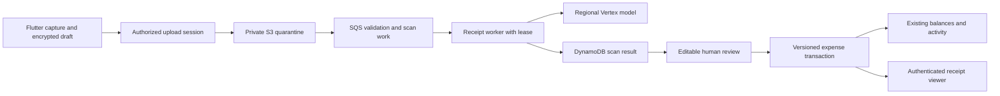

# Snap & Split implementation plan

Prepared 26 September 2026 against Hisaab commit `15cf5cf`. Status: **proposed plan, not implemented**. The [original specification](docs/snap-split-product-spec.md) is preserved unchanged. This document answers its first two open questions with recommendations, identifies decisions that need confirmation, and maps all 38 acceptance criteria to implementation and verification work.

## 1. Recommended decisions

**Q1: use five successful scans per IST calendar month for free accounts and 100 for subscribers.** Keep ₹299/year as the intended India store price; display the store's actual localized price. Describe the benefit as “Up to 100 scans/month”, because an enforced cap should be visible before purchase. This changes the parent's ad-removal-only promise and needs a new product decision record, subscription copy, privacy disclosures and store metadata. Existing manual expense features remain available without a scan allowance.

**Q2: prefer paid Vertex AI with AWS workload identity federation.** Start the evaluation with `gemini-3.5-flash` in `asia-south1`. Its model card currently lists Mumbai for both model availability and ML processing. The newer GA `gemini-3.8-flash` lists global, US and EU availability, with US/EU processing; blindly selecting the newest Flash would conflict with the India preference. These are evaluation candidates, not a tested production configuration. [Gemini 3.5 Flash](https://docs.cloud.google.com/gemini-enterprise-agent-platform/models/gemini/3-5-flash), [Gemini 3.8 Flash](https://docs.cloud.google.com/gemini-enterprise-agent-platform/models/gemini/3-8-flash).

Google explicitly distinguishes an endpoint's location from processing/data-residency guarantees. Confirm the selected model, features, project configuration and contractual commitments before claiming India-only processing. Do not silently fall back to a global endpoint or another provider when regional quota is exhausted. [Endpoint guidance](https://docs.cloud.google.com/gemini-enterprise-agent-platform/resources/locations), [data residency](https://docs.cloud.google.com/gemini-enterprise-agent-platform/resources/data-residency).

Vertex's published training restriction does not by itself mean zero retention: abuse monitoring and other features can retain customer data. Record the applicable retention settings and terms with the consent wording. Paid Gemini API remains an alternative requiring its own terms/region decision, not an automatic fallback. [Google training and retention documentation](https://docs.cloud.google.com/gemini-enterprise-agent-platform/resources/zero-data-retention).

No answers to the two preference questions were received while preparing this plan. They remain proposed defaults, not accepted changes to the live product. No service, paid resource or provider account is activated by this plan.

| Decision / inconsistency | Proposed resolution | Confirmation needed |
|---|---|---|
| Scan monetization and provider | Five free / 100 subscriber; Vertex with the Mumbai candidate above | Product + engineering before implementation of billing/provider behavior |
| “Current GA” versus India availability | Choose a supported GA model that satisfies the required processing region and evaluation gates; pin exact model ID, prompt and schema versions | Engineering at S0 |
| AC 29 allows payer/creator removal; AC 37 allows any member | Any current group member may remove receipt images with confirmation and an activity entry; either person in a Direct group may remove them | Product at S0; broader AC 37 governs proposal |
| AC 17 payer confirmation versus current create-on-behalf flow | New scanned-expense finalization requires the signed-in payer's confirmation; v1 does not add a cross-account approval workflow. Keep ordinary manual creation permissions | Product at S0; scanned flow must explain this restriction |
| AC 26 item names in notifications versus current generic pushes | Deliver itemised detail in the authenticated app; add an explicit per-account opt-in for detailed lock-screen previews | Product/privacy at S0; this qualifies literal AC 26 and cannot be marked passed without agreement |
| Support overrides currently grant ad removal | Paid scan allowance comes from server-verified active subscription, including accepted billing grace; an ad-only support grant does not silently grant scans | Product/support at S0 |
| AC 23 per-unit quantity split versus v2 phasing | Defer per-unit assignment to v2; v1 supports editing/splitting a quantity line into separate rows, with conserved totals | SHOULD, explicitly deferred |
| AC 30 duplicate warning | Include a warning, never automatic deletion or rejection | SHOULD, included in S4 |
| 20-second timeout, one automatic retry, “three retries” | One 20-second maximum provider attempt; at most one automatic transient retry, then one user retry: three provider attempts total per scan. Show manual fallback after the first timeout | Engineering/product at S0; no compounded SDK/SQS retries |
| Monthly budget absent; paid scans continue after free pause | Finance supplies budget B; alarm at 80%, pause new free scans at 100%. This is not a hard total-spend ceiling; paid exposure and an emergency all-AI-off switch need a separately agreed policy | Finance/ops before live inference |
| Worked example says totals match | ₹3,272 + ₹82 + ₹82 + ₹327 + ₹0.40 = **₹3,763.40**, not ₹3,860. Preserve original text, but make this a mismatch fixture (₹96.60 gap) | Correct fixtures and UX examples |

## 2. Existing code and changes required

Hisaab core is already implemented in source, contrary to the new spec's “not started” dependency labels. Existing release gates remain in [implementation status](docs/IMPLEMENTATION_STATUS.md); this plan does not imply live stores, AWS or push are verified.

| Existing area | Reuse | Required change |
|---|---|---|
| `src/Hisaab.Domain/Expense.cs`, `SplitEngine.cs`, `LedgerEngine.cs` | Integer-paise money, four total-split modes, single payer and conserved balance deltas | Add receipt reference and display split kind; item calculation produces canonical Exact shares for the existing ledger |
| `src/Hisaab.Api/Ledger/LedgerApplication.cs` | Versioned create/edit/delete/restore, group revision, event/outbox transaction | Save reviewed receipt revision and expense reference atomically; preserve attachment on ordinary edits; reject edits that would leave stale item breakdowns |
| `src/Hisaab.Api/Shared/CommandExecutor.cs` | Request digest, durable idempotency, session/account conditions | Callbacks may run repeatedly on conflicts: never call AI, upload, delete S3 objects or send pushes inside them |
| `src/Hisaab.Application/Storage/IAtomicStore.cs` and infrastructure stores | Strong reads, conditional transactions, local test store | Receipt metadata, bounded revisions, quota reservations, work leases and cleanup indexes using existing row/version patterns |
| `src/Hisaab.Api/Billing/BillingService.cs` | Authoritative subscription state and reconciled events | Explicit scan eligibility result; do not use mobile provisional ad suppression or ad-only support grants as server premium proof |
| `src/Hisaab.Api/Identity/AccountDeletionService.cs` | Resumable anonymisation and session invalidation | Cancel private scans/drafts; anonymise attached receipt uploader; retain shared evidence; purge private media |
| `src/Hisaab.Api/Shared/PushService.cs` | Post-commit outbox, device/session binding and preferences | Receipt-ready, mismatch and expense-detail routing; detailed preview preference; no media URLs in push |
| `apps/mobile/lib/core/repository.dart`, `controller.dart`, `models.dart` | Authenticated JSON API, typed state, group polling | Dedicated binary upload/media services and persisted account-scoped receipt drafts; existing JSON timeout/offline write rules are unsuitable for uploads |
| `apps/mobile/lib/features/expense.dart`, `group.dart` | Add-expense form, participants and split preview | Scan shortcut, reviewed receipt handoff, item assignment, receipt viewer and discrepancy report |
| `apps/mobile/lib/core/ads.dart`, `native_services.dart` | Protected-flow depth and consent/billing guards | Cover every capture/gallery/processing/review/paywall transition; cold/background notification routing is new work |
| `infra/Hisaab.Cdk/HisaabStack.cs`, worker and support CLI | ARM64 .NET 10, private data, SQS/DLQ patterns, scheduled repair | Private S3 media, dedicated receipt worker/queue, scoped Google identity, cleanup scheduler, quota/cost/circuit controls and support lookup |

Use feature folders (`Receipts`) and one C# type per file. Keep the current Flutter controller/repository pattern; do not migrate state management as part of this feature. Preserve existing four-mode wire values. No WebSocket rewrite, collaborative claims, bulk import, currency conversion or payment movement belongs in this plan.

## 3. Architecture and state transitions

The pipeline creates a receipt draft, never an expense. Suggested states: `awaiting_upload → validating → queued → processing → ready`; terminal alternatives `not_bill`, `unreadable`, `failed`, `cancelled`, `expired`. A validated image may move to manual review after AI failure. A confirmed draft becomes `attached`; attachment removal and expiry have independent tombstones. Keep upload/media validation status separate from inference status so provider failure does not discard usable evidence.

1. Persist a client draft ID, future expense ID and operation idempotency keys before network activity. Store consent notice version. Server binds the receipt to the signed-in uploader and target group; uploaded identifiers never establish ownership.
2. Issue short-lived upload authorization for at most three server-generated quarantine keys. Enforce size/checksum/content-type constraints, then validate actual decoded bytes, dimensions and metadata server-side. Freeze the accepted object version/checksum or copy to a unique canonical key so reuse of an upload URL cannot alter a reviewed image.
3. Upload completion is an idempotent manifest command. S3 events may wake validation but cannot launch paid inference until the complete authorized manifest is sealed. Missing/reordered/duplicate events are repaired from durable work rows. Do not enqueue one inference call per photo.
4. Atomically reserve a quota slot and create scan work only after valid media and consent are established. A dedicated worker conditionally acquires an expiring lease/fencing token. SQS redelivery must not produce concurrent processing for the same attempt.
5. Send up to three sanitized images in one request, with a fixed extraction prompt/schema and no tools, URLs to fetch, grounding or instructions from receipt text. Bound output bytes and tokens. Keep all worker credentials and prompts off the mobile device.
6. Strictly validate response schema, ranges and bill classification, then commit the result and quota transition once. A stale worker's result cannot overwrite a cancelled, attached or newer attempt. Poll status with bounded backoff while foregrounded; push only a ready/error identifier.
7. Review and preview are editable and non-authoritative. Final confirmation submits reviewed values, assignments, receipt revision and expense version. Server revalidates membership and the proposed payer rule, recalculates all amounts, and commits the ledger transaction. New scanned finalization requires the payer; later participant edits retain existing permissions and require an explicit reviewed save. A manual save while inference is pending atomically fences/cancels that generation and releases its reservation, so a late response cannot replace the attached evidence. If success was already committed, that successful scan remains counted.

Use a separate receipt worker with a bounded execution budget sufficient for one provider attempt plus validation/persistence; requeue the automatic retry instead of holding an API connection. Keep billing/deletion queues independent. Limit worker concurrency and provider calls; transient 429/5xx may retry within the attempt policy, invalid output/non-bill do not automatically retry. An ambiguous timeout can still incur provider cost: local idempotency cannot promise exactly-once billing by an external AI service.

## 4. Storage and HTTP contract

Proposed single-table access patterns; names are design placeholders to finalize in S0. Avoid table scans on user requests.

| PK / SK pattern | Data and access |
|---|---|
| `RECEIPT#id / META` | Uploader, group, media manifest/checksums, state, attached expense, revision, removal/expiry and version |
| `RECEIPT#id / SCAN#attempt` | Model/prompt/schema IDs, lease/fence, timestamps, classification, sanitized failure code and cost usage |
| `RECEIPT#id / REV#revision` and `REV#revision#PAGE#nn` | Immutable reviewed header/manifest plus bounded pages of items/charges/assignments and per-person breakdown; canonical payload hash |
| `USER#id / RECEIPT#draftId` | Owned unattached drafts, resume and account-deletion discovery; remove ownership edge when anonymising |
| `GROUP#id / RECEIPT#receiptId` | Attached receipt discovery for paged group deletion/retention work |
| `USER#id / SCAN_QUOTA#yyyyMM` | IST month, successful and reserved counts, version; retained past active attempts for repair |
| `USER#id / SCAN_ATTEMPT#timestamp#id` | Rolling-hour attempt admission records; serialized by a per-user admission row for exact concurrency handling |
| `WORK#receipt / dueTime#id` | Due scan/lease-repair work with conditional checkpoints, filtered stream wakeups and scheduled recovery |
| `WORK#receipt-purge / dueTime#id` | Non-bill, orphan, raw-output and attachment deletion deadlines; idempotent purge checkpoints |
| `GROUP#id / RECEIPT_DUP#hash#date#expenseId` | Keyed hash of normalized merchant/date/currency/total; seven-day warning query with live expense/ACL recheck |
| Existing `GROUP#id / EXPENSE#id` | Receipt ID, immutable revision/hash and display split kind; existing Exact shares remain ledger truth |

Bound a canonical receipt revision to **768 KiB serialized UTF-8**, split into at most twelve ≤64 KiB pages plus a small manifest. Support ≤150 items, ≤20 charges and ≤50 distinct member IDs, including all 50 assigned to every item. Limit item names to 200 Unicode scalars, and define explicit bounds on every other string, quantity and identifier. Prove the full supported Cartesian maximum fits these limits; adjust page bounds before accepting the contract if it does not. Enforce limits before provider parsing and final submission. A quantity is a bounded decimal string, never a binary floating-point money operand. Return a readable size error for out-of-contract content; use grand-total-only fallback for detected receipts above 150 items, not as a workaround for valid maximum assignments. Never silently truncate accepted data. Paging stays below the existing store's 400 KiB item ceiling without placing one transaction action per item. Large raw provider responses belong in short-lived encrypted diagnostic storage, not DynamoDB metadata.

The final transaction writes the receipt manifest/pages/meta and group index, expense/date index, all existing balance rows, group version, audit event/outbox, idempotency response and account/session conditions. Count actions and bytes at the 50-member limit; keep below the store's 100-action/4 MiB limits. Return a compact expense/receipt reference so the idempotency row does not duplicate the full revision. Build no second transaction for balances. A receipt can attach to only one expense; conditional state prevents two expense saves attaching the same receipt. A failed transaction leaves the draft retryable and creates no balances or notification.

| Proposed API | Purpose |
|---|---|
| `GET /v1/receipts/allowance` | Server plan/cap/used/reserved/remaining, IST reset timestamp, scan availability and reason |
| `PUT /v1/receipts/consent` | Record versioned affirmative processing consent |
| `POST /v1/groups/{groupId}/receipts` | Create upload session for AI or manual-attachment intent; UUID idempotency |
| `POST /v1/receipts/{id}/complete` | Seal validated upload manifest and request inference when selected |
| `GET /v1/receipts/{id}` | Uploader-only draft/status; attached receipt uses current group authorization |
| `POST /v1/receipts/{id}/retry` | Explicit retry with expected scan version, attempt/cost/rate checks |
| `POST /v1/receipts/{id}/preview` | Recompute reviewed reconciliation and per-person breakdown without ledger writes |
| Existing expense create/edit endpoints | Add an optional receipt-confirmation contract; version/idempotency semantics remain; normal clients cannot detach by omission |
| `POST /v1/receipts/{id}/media-ticket` and authenticated media route | Issue session-bound ticket ≤15 minutes; fetch thumbnail/bounded image chunks after fresh authorization |
| `DELETE /v1/receipts/{id}/images` | Versioned image-removal tombstone and durable purge work, retaining accounting breakdown |
| `POST /v1/groups/{groupId}/expenses/{expenseId}/receipt-flags` | Participant mismatch flag, reason category, deduplicated activity and payer notification |

Use explicit error codes such as `scan_limit_reached`, `scan_rate_limited`, `scan_paused`, `receipt_not_ready`, `receipt_not_bill`, `receipt_too_large`, `receipt_reconciliation_required`, `receipt_unassigned_items`, `receipt_currency_mismatch`, `receipt_version_conflict`. A quota or provider rejection offers manual entry/attachment. Membership failures return 404 without revealing receipt existence. Idempotent response replays must still respect current account/session and receipt access; the existing command cache checks replay before session state, so receipt routes need an authorization guard before serving cached sensitive responses.

## 5. Money and human review

All saved INR amounts use integer paise and checked arithmetic, with the existing ₹1 crore total ceiling. INR model decimal strings are parsed explicitly with a maximum of two currency decimals. Missing or ambiguous amounts remain unknown and highlighted; do not silently coerce to zero. Preserve original script and optional transliteration separately. Confidence is an uncertainty hint, not a calibrated probability; combine it with deterministic missing-field, quantity-price and reconciliation checks.

The schema distinguishes additive charges from already-included taxes. Inclusive tax is displayed informationally and never added twice. Item-specific discounts should become an edited net item amount; bill-level discounts are signed negative charges. Use line total as the reviewed amount authority, and flag quantity × unit-price discrepancies for correction. Zero-price items can be explicitly marked ignored; every other retained item must have assignees. More than 150 detected items returns a flagged grand-total-only result, not the first 150 items presented as complete.

Let `I` be the sum of reviewed line totals, `C` the sum of additive signed charges and `G` the reviewed grand total. Show `D = G − (I + C)` at all times. If `abs(D) > 100` paise, block saving until the payer corrects it or explicitly accepts proportional difference allocation. Any accepted difference, including a difference within ₹1, becomes a visible adjustment component so final shares equal G exactly. Record that acknowledgement against the reviewed payload hash; later edits invalidate it. Never merely accept a non-conserving split because it is within tolerance.

That paise reconciliation rule applies to INR-reviewed values. A foreign receipt keeps `sourceCurrency`, source decimal amounts and `sourceGrandTotal` separately from `ledgerCurrency=INR` and `confirmedConvertedTotalPaise`. Preserve source precision and reconcile source values within their own currency; never compare a source total directly with INR shares. Manual conversion requires an explicit acknowledgement tied to the reviewed source/converted values. In Split total, the existing engine conserves the confirmed INR amount and the foreign item list remains documentary. Itemised INR saving requires a separate fully reviewed INR set of item/charge amounts that reconciles to that converted total; no FX rate is fetched or inferred.

For **Split total**, reuse the existing Equal/Exact/Percentage/Shares engine and save that allocation plus the reviewed receipt. Do not imply the item list is an item-to-person assignment. For **Split by items**:

1. Give each item a stable ID. Divide its paise equally among sorted stable participant IDs, assigning remaining paise in that order. Quantity is descriptive in v1; per-unit weights are deferred.
2. Sum each person's item allocations to obtain proportional weights. Allocate additive taxes, service, tip and accepted positive adjustment using integer quotient/remainder, deterministic tie-breaking and zero-weight exclusion. Share one versioned vector set between Dart preview and C# authority.
3. Allocate discounts and negative adjustments with the same proportional intent, but cap a person's reduction at their available amount and redistribute residual reduction deterministically among eligible people. This prevents several rounded discounts making a small share negative. Specify positive-components-first, then negative components in receipt order; audit each component's exact allocated sum.
4. Support a payer override per charge: proportional default, or explicit nonnegative participant weights for that charge. Show the override in the preview. Inclusive taxes stay informational. Reject impossible discounts, negative final shares and zero item-subtotal proportional allocation; offer Split total or explicit allocation instead.
5. Validate each component's sum, each person's item/charge arithmetic and `sum(personTotals) == G`. Persist the authoritative breakdown and use those totals as existing `SplitMode.Exact` input. An itemised edit must recalculate the receipt and ledger together; stale versions return the latest data for review.

Core fixtures: ₹100/three people; ₹0.01 shared by many; multiple tiny discounts; all-zero items; zero-weight members; tax-inclusive/exclusive mix; overridden GST; negative round-off; maximum total; duplicate/removed members; 150-item payload; quantity decimals; Unicode scripts; the spec's ₹96.60 mismatch. Property tests assert conservation, determinism, nonnegative final shares and stable results regardless of input list ordering where the contract defines a canonical order.

## 6. Image access, privacy and retention

**Do not return raw S3 signed GET URLs.** They are bearer credentials, so a copied URL can be used by a non-member. Proposed media tickets are receipt-, image-, account- and session-bound, expire within 15 minutes, and require the normal authorization header. The media endpoint rechecks account/session, current membership, attachment status and removal tombstone on every request; unauthorized users receive 404. [AWS presigned URL behavior](https://docs.aws.amazon.com/AmazonS3/latest/userguide/using-presigned-url.html).

Use bounded authenticated range/chunk responses (proposed ≤1 MiB) for full images so 10 MiB files do not rely on the existing buffered API path accepting that payload in one response. Benchmark viewer latency in S0; if streaming is needed, review that architecture explicitly. No redirect to S3. Mark responses `private, no-store`; do not use a shared CDN cache. Mobile keeps viewed shared images in memory and clears them on logout, group removal and viewer exit. Access revocation prevents future downloads; it cannot erase an image someone has already viewed or captured.

Group receipt reads require `HasLeft == false`, not merely a retained ledger identity. Direct groups allow only the two current identities; drafts remain uploader-only until committed. Apply the same rule to itemised breakdowns, thumbnails, old revisions and notification detail fetches. Redact receipt detail from any generic cached expense response still available to former members; minimal accounting shares may remain in ledger history under existing policy. Fresh authorization must precede a cached idempotent read/result.

Private S3 blocks public access and requires TLS/encryption. Worker IAM reads only the relevant media/diagnostic prefixes; clients never list buckets. Client normalization strips location/EXIF, with server decode/re-encode validation as defense against bypassed clients. Validate magic bytes, decompressed pixel limits, MIME and checksums. Keep original filenames, images, OCR text, signed upload URLs, prompts, provider bodies and bearer tokens out of logs/traces/crash reports. Render model text as plain text; never open receipt-supplied links.

| Data/state | Proposed lifecycle |
|---|---|
| Local capture/review draft | Encrypted app-private files; encryption key in secure storage; excluded from backup/gallery. Explicit discard and sign-out deletion; proposed seven-day stale cleanup with visible expiry |
| Unsealed/orphan upload | Purge within 24 hours; expiration worker plus storage lifecycle backstop |
| Rejected non-bill | Block attachment immediately; purge all uploaded/derived images within 24 hours; explicit deadline worker and overdue alarm |
| Failed/unreadable scan with validated image | Keep for manual attachment or retry; proposed seven-day unattached draft expiry, clearly shown |
| Attached receipt | Retain with active shared expense; uploader account deletion anonymises references and keeps shared evidence |
| Deleted expense | Hide media immediately; restore within 30 days cancels purge conditionally; purge after deadline when still deleted |
| Explicit image removal | Deny reads immediately; durable deletion of all images/thumbs/versions/diagnostics; does not delete money or reviewed breakdown; removal is not undone by expense restore |
| Deleted group | Deny receipt access immediately; proposed 30-day media retention then paged purge of its receipt index, with no new group-restore feature implied. Product/privacy confirms this otherwise unspecified policy in S0 |
| Raw AI diagnostics | Proposed encrypted seven-day maximum, support role only, audited ticket/reason access; never used as analytics. Product/privacy must approve this retention; otherwise support sees status and validated redacted fields only |

DynamoDB TTL and S3 lifecycle alone are not deadline guarantees. Use conditional purge jobs with bounded retries and alarms. Atomically claim a final purge generation only after the restore deadline and while the expense/group remains deleted; successful restore invalidates pending generations. No restore may revive a generation already irreversibly claimed after its deadline. Re-check after object deletion and repair interrupted work. Enumerate versioned copies if versioning is enabled; a delete marker is insufficient. Do not introduce replication or backups of raw media without a deletion-aware retention policy. Before the existing account-deletion worker deletes `USER#id` rows, checkpoint private-job cancellation, quota release, shared-uploader anonymisation and private-media purge discovery; otherwise the ownership indexes would disappear. Prevent stale AI responses recreating deleted private data. Restore drills must reapply tombstones before exposing recovered data.

Anonymous correction metrics contain field categories and boolean changes, model/schema version and coarse script/category aggregates; omit field values and stable receipt/user identifiers. Keep acquisition/conversion analytics separate, consent-controlled and pseudonymous rather than calling linked account events anonymous. Raw diagnostic output is separate from prompt-improvement data. A real-bill evaluation corpus needs independent contributor permission and protected storage; production receipts are not silently copied into it.

## 7. Allowances, retries and cost controls

Assign each reservation generation's quota month using server time in `Asia/Kolkata` when inference is admitted. An automatic retry retains its active reservation and month. A valid bill result becoming `ready` counts as one successful scan, even if later edited, discarded or saved manually; saving never consumes a second scan. Non-bill, unreadable, cancelled-before-success and terminal failures release the reservation once. Completed successful scans are not refunded on expense deletion.

A user retry after terminal failure must atomically acquire a new reservation generation in the **current** IST month, rechecking current subscription/cap, hourly admission and cost limits. Require `failed` state with no active lease/reservation, then advance its fence. Keep the same logical scan ID, frozen media and cumulative three-attempt maximum; crossing a month boundary never resets that attempt ceiling. A retry of active work returns its status; an idempotent retry replay cannot reserve twice. The old released slot cannot be reused without this new admission.

Admission condition is `successful + reserved < effectiveCap`. Increment reservation, attempt admission and job state atomically with a version condition on the authoritative entitlement used to choose the cap. Mobile entitlement state cannot increase allowance. UI shows confirmed successes, pending reservations and available slots distinctly. Concurrent fifth/sixth attempts allow only one final slot. Month rollover does not release old live reservations into the new month or count an old result twice. A repair worker expires abandoned reservations only after invalidating their lease/fence.

At lapse, new admissions use the free cap and all successes in that month. Already admitted work may finish within its reservation; ready results remain reviewable/savable. Manual attachment does not consume scan allowance. At a free cap, offer upgrade or manual entry. At a subscriber's 100 cap, show reset time and manual entry rather than selling the same subscription again.

Enforce a server-side rolling-hour limit of ten provider attempts per account, including failures and retries, plus one active provider attempt per scan. Query the bounded recent attempt keys and serialize admissions through the per-user admission row to prevent parallel overshoot. Gateway-wide throttling is additional protection, not a user-specific allowance. Add independent limits for upload-session creation, image downloads and total outstanding media bytes so free manual attachments cannot create unbounded storage/egress cost.

Track estimated spend for every provider attempt, including failures, retries and abandoned successes. Reserve a conservative maximum inference cost before dispatch based on pinned pricing/input/output limits; settle using usage and reconcile against provider billing exports. An ambiguous request keeps its conservative cost until reconciled. Budget decisions must use a documented billing currency and conversion policy; do not invent a rupee ceiling.

Use controlled runtime flags: new-scans enabled, free-scans enabled, provider circuit open and detailed-push enabled. They never disable viewing saved receipts or manual expense entry. At B×80% alarm; at B pause new free admissions atomically, allowing already admitted bounded work to finish. Paid scans continue per the requested policy, so total spend can exceed B. Bound worker concurrency, per-account attempts and paid population exposure; agree emergency behavior before launch. Provider outage opens the circuit and keeps manual capture available. Google/AWS budget notifications are monitoring inputs, not a synchronous spending lock.

## 8. Flutter delivery

Create `features/receipts/` with capture, processing, review, assignment, viewer and discrepancy screens; put draft/upload/media adapters under `core/receipts/`. Keep a stable draft state machine outside widgets so navigation, process death and connection changes do not lose work. Each async completion verifies the originating account/session before updating storage or UI.

Capture accepts camera/gallery JPEG, PNG and HEIC; PDF import renders only the first three pages locally, with a visible notice if more exist. Upload normalized JPEG/PNG pages, not the source PDF. Display page order, delete/retake, auto-crop preview and a manual crop/shutter fallback. Correct orientation before stripping metadata; resize longest side to ≤2048, re-encode and check ≤10 MiB per page after compression. Test decode failure, transparency, rotated HEIC, password-protected/malformed PDFs and large decompression dimensions.

S0 must prove a bundled offline camera/edge/crop path on the currently supported devices. Android's ML Kit document scanner downloads its components and has device constraints; it cannot alone establish first-use offline support. Native HEIF support also does not cover every existing Android 23+ device, so a vetted decoder or an explicitly agreed support restriction is required. Do not silently replace HEIC or edge detection MUST criteria with an error message. [ML Kit scanner constraints](https://developers.google.com/ml-kit/vision/doc-scanner/android), [Android supported formats](https://developer.android.com/media/platform/supported-formats).

Consent appears before the first AI upload, describing Google processing, group visibility, retention and a manual alternative. Persist acceptance version on the server; locally record pending acceptance for offline capture, but never infer/upload until server authorization confirms it. Manual attachment can work without AI consent because no Google call occurs. Camera denial offers gallery; gallery/files cancellation preserves the draft.

Offline capture queues sanitized files and review state. Resume uploads while foregrounded after connectivity/auth/group revalidation; show upload progress and retry state. If the app is killed before upload, v1 resumes on the next foreground session. A server-completed scan uses push, and a foreground completion may use a local notification if permitted; v1 does not promise background upload/resumability. Retry a file safely under the same draft manifest; retry expense save with the original persisted ID/key and exact payload. If the payload changes, use a new key with the correct expected expense version.

Review supports every field, add/delete items, flagged confidence, image toggle/zoom, sticky reconciled total and a per-person component preview. Item assignment has accessible list checkboxes alongside avatars. Return-to-review preserves edits; a conflict displays the latest server revision and keeps the local draft for deliberate reapplication. Foreign currency remains visible, but INR save requires manual conversion: default to Split total with an explicitly entered INR amount unless every item/charge is converted and re-reviewed.

Wrap the whole flow in the existing protected-ad scope, including native capture return, processing, errors and review. No ad prefetch/request or banner survives on these routes. At cap/error/offline, manual entry remains reachable. Add receipt thumbnails and breakdowns to expense details, flag/removal controls according to fresh permissions, and authenticated push/deep-link routing for foreground, background and cold starts. Reject prior-account notifications after account switching.

## 9. Delivery sequence and exit criteria

Estimate **6–8 weeks of engineering work after S0 inputs**, with one backend engineer, one mobile engineer and part-time ML/QA. The spec's 5–6 weeks is an optimistic case if camera/decoder/federation prototypes and the labelled corpus are ready. Account setup, legal review and store approvals add calendar uncertainty. Re-estimate after the native and region spikes; do not treat this estimate as a completion promise.

| Stage | Work / owner | Exit evidence |
|---|---|---|
| S0 — decisions and spikes, 3–5 working days | Product resolves decision table; platform proves Lambda ARM64 → WIF → selected regional model; mobile proves offline edge/crop, HEIC and PDF; ML starts labelled corpus; finance supplies B | Decision record, platform device matrix, one consented receipt round-trip, pinned config candidate, measured payload/latency and bounded cost model |
| S1 — manual shared receipt, week 1–2 | Backend S3/quarantine/authenticated media/deletion; mobile encrypted draft/capture/upload/viewer | Capture → manually confirm → expense → authorized viewer; copied-link and former-member negatives; no inference or scan charge; interrupted upload/save recovery |
| S2 — extraction and allowance, week 2–3 | Backend queue/lease/schema/Vertex/quota; mobile consent/status/review/manual fallback; ML initial evaluation harness | Only validated results enter review; duplicate delivery and concurrent cap tests; provider timeout/circuit/manual path; model never writes ledger |
| S3 — itemised ledger, week 3–4 | Backend/Dart shared vectors, assignments and charges, atomic receipt/expense revisions; mobile preview/conflict UX | Cross-language conservation/property tests, max-size 50-member transaction, two-writer reject, delete/restore preserves correct deltas and attachments |
| S4 — sharing/product, week 4–5 | Mobile/background routing; backend mismatch/duplicate notification, subscription copy, support lookup, deletion/retention and runtime flags | Current-group visibility, detail preference, paid-cap UX, anonymisation, purge deadlines and support audit tests |
| S5 — hardening/beta, week 5–8 | ML 200+ bill benchmark; device accessibility; platform IAM/load/failure drills; privacy/store review | All MUST evidence below, measured p90≤10 s single-image upload-complete→ready, p50≤5 s/p95≤12 s, safe rollback and signed-device beta |

First implementation slice: a real captured image attached to a manually confirmed expense, visible only through authenticated membership checks, with delete/restore/removal and replay tests. It establishes the privacy and persistence foundation before paid inference.

Model changes require the same protected ≥200-bill corpus across restaurant, grocery, fuel, pharmacy, handwriting and at least five Indian scripts. Report extraction success, total/tax zero-edit rate, item/amount accuracy by category/script, not-bill false positives, latency and total attempt cost per success. Targets from the spec: ≥92% valid reading and ≥85% total/tax zero-edit; define denominators and label unknowns. Proposed upgrade gate: no regression overall or in supported script categories, and equal/lower measured cost; review statistical uncertainty on small categories. The corpus, labels, raw images and evaluation credentials must not enter public Git history.

Pin provider/model ID, prompt/schema versions, decoding settings and pricing version together. Monitor deprecation and rerun evaluations before upgrades; avoid unversioned “latest” aliases. Google's current lifecycle lists a longer availability period for 3.5 Flash and retirement of 2.5 Flash on 20 October 2026, which makes 2.5 an unsuitable fresh default. [Model lifecycle](https://docs.cloud.google.com/gemini-enterprise-agent-platform/models/model-versions).

## 10. Acceptance coverage

All rows are planned evidence, not completed tests. Any proposed deviation in section 1 requires agreement before claiming its AC satisfied.

| AC | Stage | Required evidence |
|---|---|---|
| 1 | S1 | Add-expense and group scan entry points, empty-state discoverability |
| 2 | S0/S1 | JPEG/PNG/HEIC and PDF first-three-page device matrix, malformed/protected imports |
| 3 | S0/S1 | Visible edge detection, crop preview and retake on supported physical devices, including offline first use |
| 4 | S1/S2 | One/three photos, fourth rejected, ordered manifest, overlapping lines flagged for review |
| 5 | S1 | Inspect actual uploaded bytes: orientation correct, ≤2048 longest side, EXIF/GPS absent |
| 6 | S1 | Boundary byte-size tests and server rejection when client validation is bypassed |
| 7 | S1 | Permission denied/permanently denied paths with working gallery fallback |
| 8 | S2 | Labelled merchant/date/currency/items/tax/service/discount/tip/round-off/total fixtures |
| 9 | S5 | Instrumented p90≤10 seconds for single-image upload-complete→ready; progress at every state; separate capture/network latency |
| 10 | S2/S3 | ₹1 and above/below boundary, explicit gap acknowledgement invalidated after edit, exact final sums |
| 11 | S2 | Unknown/low-confidence field cues announced accessibly; no false certainty from missing confidence |
| 12 | S2/S4 | Selfie/blank fixtures create no expense or successful charge; 24-hour media purge |
| 13 | S2 | Blurry/faded/glare images show actionable retake guidance and manual alternative |
| 14 | S2/S5 | At least five-script corpus and physical-device text rendering; original/transliteration retained separately |
| 15 | S2 | Printed injection/URLs, extra JSON properties, invalid numbers and malformed output rejected; no model tools/actions |
| 16 | S1/S2 | Provider disabled/timeout/errors still permit manual confirmation with validated image |
| 17 | S2/S3 | No ledger writes before authenticated payer confirmation; repeated processing never creates expense |
| 18 | S2 | Every field editable, add/delete/reorder items and draft restart tests |
| 19 | S3 | Four existing total modes remain compatible; item mode persists as exact authoritative ledger shares |
| 20 | S3 | Single/shared assignments, unassigned blocking, explicit zero-item ignore, stale/removed member errors |
| 21 | S3 | Property/vector tests for signed charges, overrides and tiny discounts; exact paise conservation |
| 22 | S3 | Items/tax/service/discount/tip/adjustment component preview equals each final share |
| 23 SHOULD | v2 | Per-unit assignment deferred; v1 row splitting preserves amount and is clearly manual |
| 24 | S1/S4 | Thumbnail/full image/breakdown for current group members and only the Direct pair |
| 25 | S1/S4 | Copied ticket without session, wrong account, expired ticket, revoked membership and removed image all denied |
| 26 | S4 | Authenticated itemised notification detail; opt-in lock-screen preview and muted preferences, subject to decision |
| 27 | S4 | Participant flag emits one deduplicated activity event and payer notification; no automatic money reversal |
| 28 | S3 | Concurrent edit conflict, original image preserved, old-client edit cannot silently detach or corrupt breakdown |
| 29 | S4 | Delete/restore around 30-day boundary, restore/purge race, removal permissions and all-version purge |
| 30 SHOULD | S4 | Seven-day duplicate candidate, renamed/deleted/unauthorized expense filtering, warning-only save |
| 31 | S2 | Five-success cap, concurrent final slot, IST midnight/month rollover, counter pending state |
| 32 | S2/S4 | Verified subscription permits 100; grace/lapse/revoke, support-only grant and provisional-client negatives |
| 33 | S2 | Failure/non-bill refund once, duplicate result charge once, retry and lease-repair races |
| 34 | S2/S4 | Free cap upgrade/manual options; paid cap reset/manual path; offline manual draft preserved |
| 35 | S1/S4 | Ads-enabled tests across every protected route, errors, app resume and native capture return |
| 36 | S2 | Versioned consent before first inference; decline/manual path; offline acceptance cannot bypass server check |
| 37 | S4 | Account deletion cancels private jobs, anonymises shared uploader, preserves group evidence and permits current-member removal |
| 38 | S1/S5 | Synth/IAM tests, public access negatives, encryption verification and logs/traces redaction inspection |

## 11. Verification, rollout and external inputs

Implementation CI extends the existing .NET domain/API/storage/infrastructure/support tests and Flutter analyze/test suites. Add focused shared arithmetic vectors, worker lease/idempotency failures, media ACL/retention tests and contract fixtures. Native builds and signed physical-device journeys are required for camera, HEIC, PDF, process death, privacy metadata and push; widget mocks cannot establish them. Run storage/IAM/queue tests in an authorized staging environment and a real regional provider evaluation before enabling AI.

Measure cost per success including failed calls, not just happy-path tokens; budget alert latency, queue/DLQ age, expired lease recovery and privacy purge deadlines. Alarm on sustained DLQ depth >0 for 15 minutes, repeated schema errors, cost-per-success +30% week-on-week, reconciliation mismatches and overdue purge jobs. Do not place high-cardinality receipt IDs or merchant/item text in metric labels.

Instrument scan-origin expenses / all new expenses (25% month-two target), item-split / scan-origin saves (35%), cap-hit accounts purchasing within seven days / cap-hit accounts (6%), flags / 100 scanned expenses (<1), and D30 retention cohorts with/without a scan (+10 percentage-point target, association rather than a causal claim). Define late events and deduplication per committed expense/flag. Track provider error plus invalid-output calls / all provider calls (<2%) separately from valid-reading success, since retries change denominators. These are launch targets, not demonstrated results; consent-controlled conversion/cohort events must not include receipt content.

Release behind default-off scanning/provider flags. Deploy additive backend fields first, then compatible mobile clients; legacy expenses without receipt fields keep current behavior. A legacy edit that cannot preserve itemised consistency returns an upgrade/review requirement instead of silently rewriting the split. Exercise disable-new-scans rollback while retaining manual capture, saved receipt access, reviews and existing expense operations. Do not roll back ledger data by replacing the database.

Inputs needed: Google billed project/quotas, region and data-use confirmation, restricted WIF trust to the exact AWS account/receipt role, AWS environment and media retention policy, scan quota/subscription decisions, finance budget and emergency policy, reviewed privacy/store declarations, permissioned 200-bill corpus and physical test devices. Google documents keyless federation using AWS temporary credentials; the actual .NET/Lambda credential refresh path still needs the S0 integration test. [Workload identity federation](https://docs.cloud.google.com/iam/docs/workload-identity-federation-with-other-clouds).

No SnapStart, OpenSearch, Elasticsearch, AOSS, SearchCache or AWS WAF is introduced. No credentials, real receipt images or raw model outputs belong in the repository. Existing Hisaab production gates remain in force.

Planning is complete when the source spec is preserved, decisions and assumptions are visible, all ACs have an owner/stage and observable test gate, and an independent consistency review passes. This documentation does not report application changes, extraction accuracy, provider access, infrastructure deployment or store acceptance as completed.
